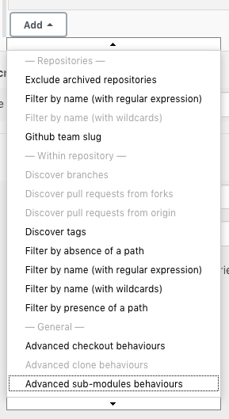

# About SCM Filter Contents Plugin

This plugin provides filters for SCM API based plugins that work based on the presence or absence of specific
  file paths in the branch.

# Setup

After installing this plugin, two new options will appear in the branch filters:
  

* Filter by absence of a path
* Filter by presence of a path

Each filter takes a single path and excludes or includes respectively the branch / tag / change request if the path exists.

# Use case

## Dualing Jenkinses

You have two Jenkins instances with an organization folder pointing at the same organization.

Both of these instances will discover the same repositories and the same branches / tags / change requests leading to competing builds.

One solution is to put a marker file in the root of all the repositories that indicates which Jenkins instance should build and then use the _Filter by presence of a path_ filter on each Jenkins to look for their respective marker file.

Another solution is to use the presence / absence of a single file to indicate which Jenkins instance should build.

